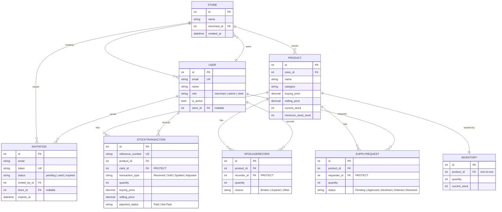

# MyDuka Backend

Django REST API for MyDuka — a multi-tenant shop inventory, staff, and reporting
platform. Each **store** belongs to a **merchant**, who invites **admins** to run
day-to-day operations, who in turn create **clerk** accounts to receive stock,
sell stock, log spoilage, and raise supply requests. All inventory data is
scoped to the caller's store.

## Stack

- Django 6.1 / Django REST Framework
- PostgreSQL (via `psycopg`), SQLite-free — a local Postgres container is
  provided via `docker-compose.yml`
- JWT auth via `djangorestframework-simplejwt`
- API docs via `drf-spectacular` (OpenAPI 3 + Swagger UI)

## Getting started

### Option A — Docker (recommended)

```bash
docker compose up --build
```

This starts Postgres (`db`) and the Django dev server (`web`) on
`http://localhost:8001`, using the settings in `.env`.

### Option B — Local virtualenv

```bash
python3 -m venv .venv && source .venv/bin/activate
pip install -r requirements.txt
cp .env.example .env   # fill in SECRET_KEY and DATABASE_URL (or DB_* vars)
python manage.py migrate
python manage.py runserver
```

By default the app connects to Postgres using `DB_NAME` / `DB_USER` /
`DB_PASSWORD` / `DB_HOST` / `DB_PORT` (matching `docker-compose.yml`). Set
`DATABASE_URL` instead (e.g. for a managed Postgres instance) and it takes
priority.

### Seeding a merchant

There is currently no public "sign up" endpoint — a merchant + store is
created directly, then the merchant invites admins through the API:

```bash
python manage.py shell -c "
from apps.accounts.models import User, Store
merchant = User.objects.create_user(email='owner@example.com', password='changeme123', name='Owner', role=User.Role.MERCHANT)
store = Store.objects.create(name='My Shop', merchant=merchant)
merchant.store = store
merchant.save(update_fields=['store'])
"
```

From there: `POST /api/auth/login` as the merchant → `POST /api/auth/invitations`
to invite an admin → the admin completes `POST /api/auth/register-admin` with
the invitation token → the admin can then create clerks via `POST /api/auth/clerks`.

## API documentation (Swagger / OpenAPI)

- Interactive Swagger UI: `GET /api/docs/`
- Raw OpenAPI 3 schema: `GET /api/schema/`
- Human-oriented endpoint index: `GET /api/`

All endpoints except `/api/auth/login`, `/api/auth/health/`,
`/api/auth/invitations/<token>` (lookup) and `/api/auth/register-admin` require
a JWT: `Authorization: Bearer <access_token>` (obtained from `/api/auth/login`).

Responses from the inventory endpoints use a `{"success": bool, "data": ...}`
(or `"message"` on error) envelope; accounts endpoints return the resource
directly with a `{"detail": ...}` shape on error.

## Running tests & coverage

```bash
python manage.py test                       # 54 tests across accounts/inventory/reports
coverage run manage.py test
coverage report -m                          # per-file breakdown
coverage report --fail-under=70             # CI gate
```

Coverage is currently **~92%** overall (`.coveragerc` excludes migrations and
`manage.py`).

## Data model



Notes on the schema:

- `Product.store` scopes every catalog and transaction record to one store —
  no cross-store data is ever visible to a request.
- `StockTransaction.clerk`, `SpoilageRecord.recorder`, and
  `SupplyRequest.requester` use `on_delete=PROTECT`: a user who has ever
  recorded a transaction cannot be hard-deleted, preserving the audit trail
  (deactivate them instead via `PATCH /api/auth/.../deactivate`).
- Reports (`/api/v1/reports/...`) are computed live from `StockTransaction`
  and `SpoilageRecord` — there is no separate reporting/analytics table.

## Architecture notes / known gaps

- **No merchant self-signup endpoint.** Merchant + first store are created
  directly (see "Seeding a merchant" above); only the admin/clerk invitation
  flow is exposed over the API.
- **Reports permission is `IsAuthenticated`**, not role-restricted — any
  authenticated store member can view sales figures for their store. Consider
  tightening to merchant/admin only if that becomes a requirement.
- **Payment tracking is best-effort**: `payment_status` on a `StockTransaction`
  reflects whether it's been marked paid by an admin, not an integration with
  a real payments provider.

## Project layout

```
config/            settings, root URLconf, OpenAPI config, API root view
apps/accounts/     users, stores, invitations, JWT auth, role permissions
apps/inventory/    products, stock movements, spoilage, supply requests
reports/           read-only reporting views computed from inventory data
```
